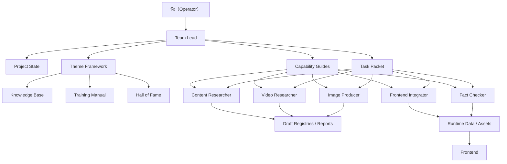

# 整体架构 V2 / Architecture Overview

---

## 一、四层结构

### 1. 状态层

回答：项目现在是什么样。

- 当前规模
- 当前目录
- 当前真源文件
- 当前活跃角色

### 2. 主题层

回答：这个主题是什么、最小内容单位是什么、要展示什么。

例子：
- 知识库
- 训练手册
- 名人堂

### 3. 能力层

回答：谁来搜内容、谁来找视频、谁来出图、谁来整合、谁来纠错。

能力型角色尽量跨主题复用。

### 4. 执行层

回答：这一次具体做什么。

这里不应该直接把大 guide 丢给 bot，而应该由 Team Lead 生成一个小型任务包。

---

## 二、为什么这样更稳

### 旧问题 1：主题一变就想重写 bot

因为旧体系里 bot 和主题绑定太紧。

### 新做法 

让 bot 绑定能力，不绑定主题：
  
- 内容收集是能力
- 视频收集是能力
- 图片生产是能力
- 前端整合是能力

主题只是这些能力的“输入框架”。

### 旧问题 2：输出格式不统一

因为每个专题 guide 都在自己定义输出。

### 新做法

输出分成两类：

- `draft`
- `runtime`

所有研究类 bot 默认只产出 draft，不直接污染前端运行时数据。

### 旧问题 3：上下文崩溃

因为执行时带了太多历史背景。

### 新做法

执行 bot 只看三类文件：

1. 当前主题 framework
2. 当前能力 guide
3. 当前任务包

---

## 三、设计原则

1. 新主题优先新增 framework，不优先新增 bot。
2. 新需求优先生成 task packet，不优先改大 guide。
3. 研究类结果先进入 draft registry。
4. 整合进入前端前必须过 review gate。
