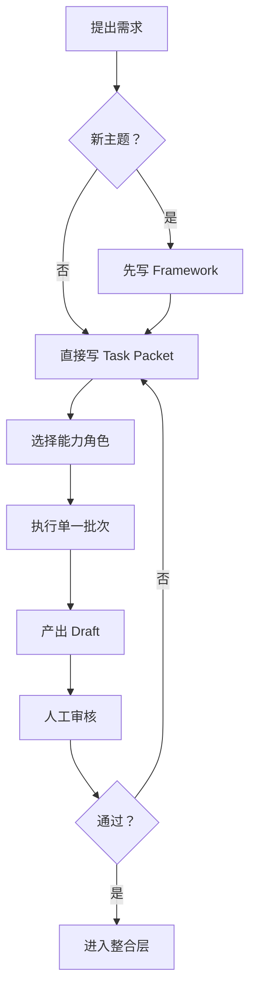

# Operator 操作手册 / Operator Playbook

> **适用对象**：你作为项目操作者，每次想推进一件事时，应该按什么顺序做。

---

## 一、先判断你当前属于哪一种工作

### 类型 A：定义新主题

例子：
- 新增“名人堂”
- 新增“训练手册”

### 类型 B：推进已有主题

例子：
- 给名人堂补 5 个运动员
- 给知识库补一批视频

### 类型 C：纠错或返工

例子：
- 某批图片不对
- 某条内容有误

---

## 二、你的标准流程

---

## 三、你每次应该实际做什么

### Step 1：先写一句话目标

例子：

- “我要增加名人堂主题”
- “我要给名人堂补一批视频”
- “我要把名人堂前端页面接上”

### Step 2：判断是主题问题还是执行问题

如果你还没定义清楚内容单位、字段、页面目标，这是主题问题。  
如果主题已经有 framework，只是还没做内容，这是执行问题。

### Step 3：只给 Team Lead 一个很小的目标

不要直接说：
- “把名人堂做完”

更好的说法是：
- “请输出名人堂 framework”
- “请输出名人堂第一批内容收集任务包”
- “请输出名人堂前端接入任务包”

### Step 4：让执行 bot 只吃任务包

执行 bot 默认输入：

1. 当前主题 framework
2. 当前能力 guide
3. 当前 task packet

不默认吃整个项目所有文档。

### Step 5：先审 draft，再进前端

研究草案、视频草案、图片草案都先看一遍。  
通过后再让前端整合 bot 写 runtime data。

---

## 四、最关键的操作习惯

1. 不直接把一个大想法扔给执行 bot。
2. 不在执行阶段临时修改 framework。
3. 不让研究类 bot 直接改前端运行时文件。
4. 不让任何 bot 一次处理过大的范围。

---

## 五、最推荐的批次粒度

### 内容收集

- 5-10 个条目一批

### 视频收集

- 1 个主题块或 10-20 个条目一批

### 图片生成

- 1 个模块一批

### 前端整合

- 1 个 registry 或 1 个页面功能一批

### 纠错

- 1 个争议点或 1 组同类型问题一批
