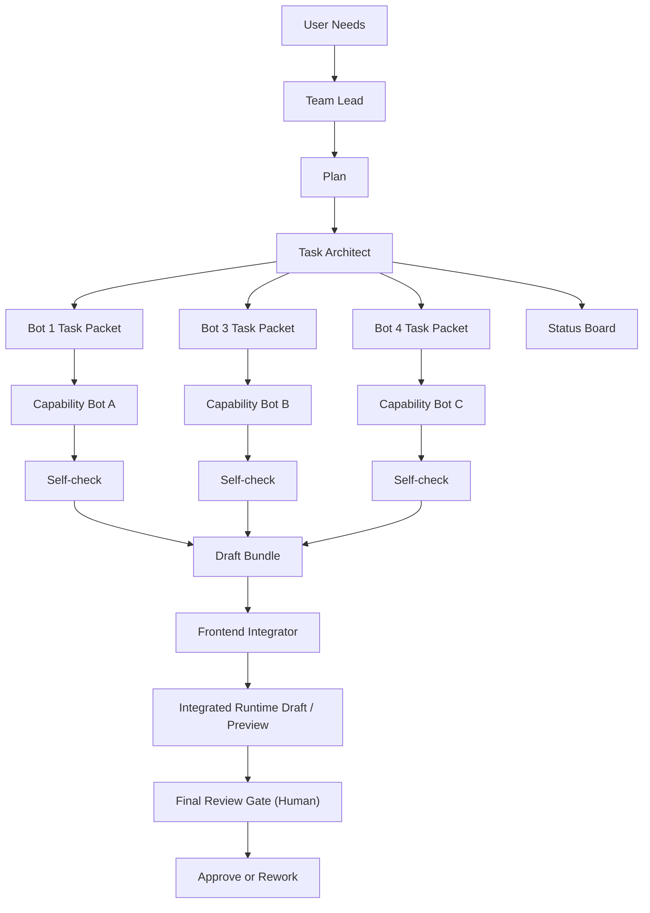

# 架构总览 V3 / Architecture Overview

---

## 一、角色分工

### Team Lead

负责：
- 理解需求
- 决定要不要做
- 决定这次需要哪些 bot
- 产出一个高层 `Plan`

不负责：
- 给每个 bot 写细节执行包
- 中间汇总每个 bot 的结果

### Task Architect

负责：
- 把 Team Lead 的 Plan 变成多个 task packet
- 标明哪些包可以并行
- 标明每个包的自检标准
- 维护状态看板

不负责：
- 人工审核内容质量
- 最终整合到前端

### Capability Bots

负责：
- 按任务包执行
- 输出自己的草案产物
- 完成 self-check

不负责：
- 改 framework
- 改其他 bot 的输出
- 直接改 runtime data

### Frontend Integrator

负责：
- 汇总已通过 self-check 的草案
- 整理成统一的 runtime draft
- 接入前端页面或数据层

不负责：
- 替内容 bot 补研究结论
- 替 Task Architect 重拆任务

### Human Final Review

只做一次总审：
- 整体是否成立
- 哪些通过
- 哪些返工

---

## 二、关键原则

1. **Team Lead 产出的是 plan，不是细节任务包。**
2. **Task Architect 增加的是并行能力，不是人工 review 次数。**
3. **中间检查默认自动化或 bot 自检。**
4. **人工 review 只收口在最终 review gate。**
5. **Frontend Integrator 是唯一的整合入口。**
