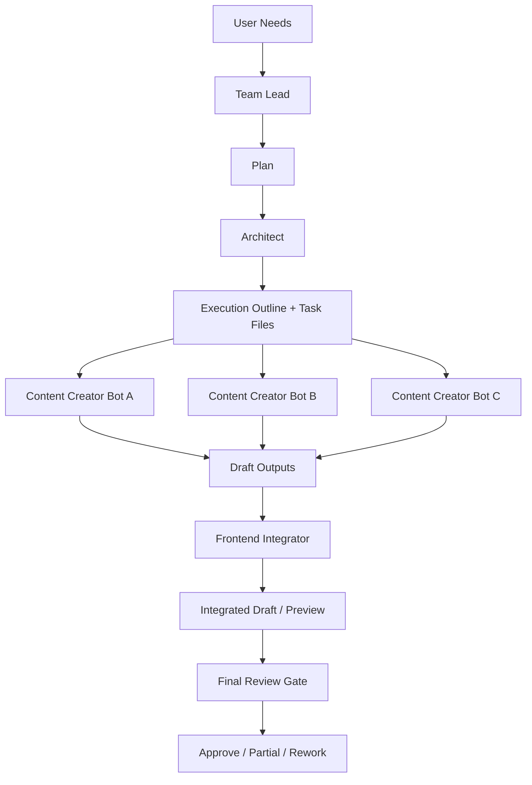

# 架构总览 V4 / Architecture Overview

---

## 一、角色链路

### 1. Team Lead

负责：
- 理解需求
- 决定目标与范围
- 决定调用哪些 bot
- 设定数量、质量和交付目标

输出：
- `Plan`

### 2. Architect

负责：
- 读取 Plan
- 把高层目标翻译为执行大纲
- 为各 bot 生成任务文件
- 定义搜索方向、边界、产出格式

输出：
- `Outline`
- 各 bot 的任务文件
- 状态板

### 3. Content Creator Group

负责：
- 根据 Architect 的任务文件实际搜集内容
- 记录来源
- 写入 draft
- 输出完成报告

输出：
- `draft`
- `content report`

### 4. Frontend Integrator

负责：
- 汇总多个 draft
- 做统一结构整理
- 接入前端数据层和展示层
- 形成整体预览

输出：
- `integrated draft`
- `integration report`

### 5. Final Review Gate

负责：
- 对整体结果做一次人工总审
- 决定通过、部分通过、返工

输出：
- `final review decision`

---

## 二、为什么这样分层

### Team Lead 不直接写细节任务

因为它要控制的是：
- 目标
- 方向
- 成功标准

而不是：
- 搜索关键词
- 每个 bot 怎么写字段

### Architect 不直接做内容

因为它的价值是编排和拆分。  
如果它开始亲自搜内容，就会和内容组重复。

### Content Creator Group 不直接进前端

因为研究草案和前端运行时数据是两种不同的东西。

### 人工 review 只在最后发生

这样不会因为多 bot 并行而增加你的 review 次数。

---

## 三、固定的产物链路

### Step 1

`Need -> Plan`

### Step 2

`Plan -> Outline + Task Files`

### Step 3

`Task Files -> Draft Outputs`

### Step 4

`Draft Outputs -> Integrated Draft`

### Step 5

`Integrated Draft -> Final Review Decision`

---

## 四、固定原则

1. `Plan` 不越界写具体执行颗粒度
2. `Outline` 不越界替内容组写正式内容
3. `Content Creator Group` 不直接改 runtime 数据
4. `Frontend Integrator` 不替内容组补研究结论
5. `Final Review Gate` 只看整体结果，不看所有中间细节
